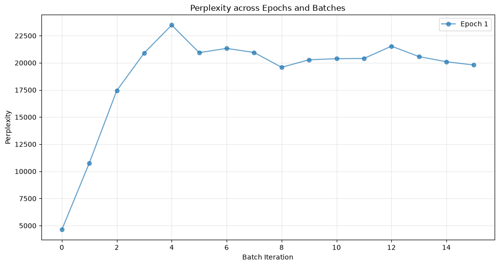

# Findings

_This document is a log of findings through the implementation of this research project and contains my own analysis for each._

## 2026-07-07: Model collapse on gradient descent

Despite the very small gradient descent, we are observing that the perplexity of the model shoots up by a factor 4 after seeing 4 batches of 8 training examples. Entropy of the output probability distribution seems to increase by 25% after seeing one single batch, and remain constant. 

### Training Parameters

| Parameter | Value |
|-----------|-------|
| Optimizer | SGD |
| Learning Rate | 1e-9 |
| Batch Size (Train) | 8 |
| Batch Size (Validation) | 16 |
| Epochs (Default) | 1 |
| Gradient Checkpointing | Enabled |
| Sequence Length | Variable |
| Loss Function | CrossEntropyLoss |
| Tokenizer | TinyLlama |
| Model | TinyLlama v1.1 |
| Device | GPU (if available) |
| Shuffle (Train) | True |
| Shuffle (Validation) | False |

### Generation Parameters

| Parameter | Value |
|-----------|-------|
| Max New Tokens | 20 |
| Top-k Sampling | 10 |
| Repetition Penalty | 1.3 |
| Temperature | 0.6 |

